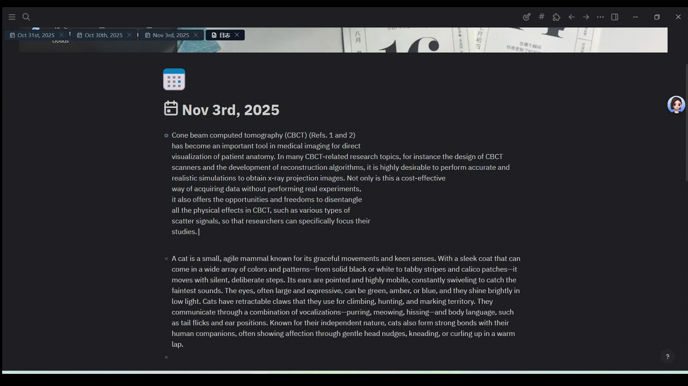
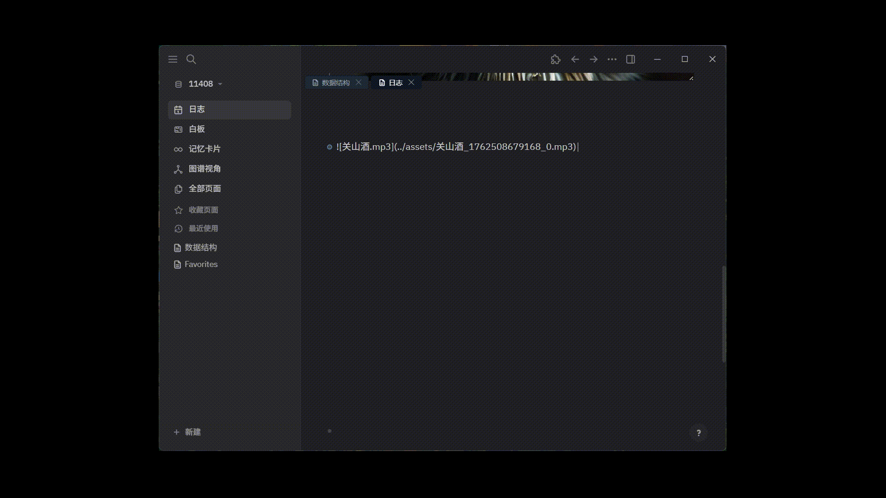

<p align="center">
  <a href="" rel="noopener">
 </a>
 </a>
</p>

<h3 align="center">Logseq GPT Plugin</h3>

</div>


---

<p align="center">
  Support OpenAI API standard interface, providing text generation, image generation, and speech-to-text functionality
</p>


## ✨ Features

- **🤖 Smart Text Generation**: Support GPT-3.5, GPT-4 and other OpenAI API standard compatible models
- **🎨 Text to Image**: Create high-quality images using DALL-E 2/3 and other compatible models
- **🎤 Speech to Text**: Integrate Whisper model for efficient speech recognition
- **🔧 Flexible Configuration**: Provide independent API endpoints and keys for text, image, and speech services
- **⌨️ Keyboard Shortcuts**: Quick access to AI commands, improving work efficiency
- **📝 Custom Prompts**: Define system prompts to guide AI behavior, support multiple preset commands

## 🚀 Quick Start

### Basic Usage

#### Text Generation Commands
- `/gpt-block` - Generate AI content for the current block
- `/gpt-page` - Generate AI content for the entire page
- `/gpt` - Open AI command panel

#### Image Generation
- `/text2img` - Generate images based on text description

#### Speech to Text
- `/whisper` - Convert speech in audio files to text

## ⚙️ Configuration

### Required Settings

#### Text Generation Model
- **API Key**: OpenAI API key for text generation
- **API Base URL**: Base URL for text generation service
- **Model Name**: GPT-3.5, GPT-4 or other OpenAI API compatible models

#### Image Generation Model
- **API Key**: API key for image generation
- **API Base URL**: Base URL for image generation service
- **Model Name**: DALL-E 2, DALL-E 3 or other compatible models

#### Speech to Text Model
- **API Key**: API key for speech to text
- **API Base URL**: Base URL for speech to text service
- **Model Name**: Whisper-1 or other compatible models


## 🎯 Usage Examples

### Text Generation

<p align="center">
 </a>
</p>


### Image Generation

<p align="center">
 </a>
</p>


### Speech to Text

<p align="center">
 </a>
</p>


## ⌨️ Keyboard Shortcuts

- **Mod+G**: Open AI command panel
- **Mod+J**: Quick GPT block generation

## 🔧 Development Guide

### Requirements
- Node.js
- pnpm

### Local Development
```bash
pnpm i
pnpm run dev
```

### Production Build
```bash
pnpm run build
```

## 🐛 Troubleshooting

### Common Issues

1. **API Key Error**: Ensure your OpenAI API key is valid and has sufficient balance
2. **Rate Limit**: If you encounter rate limits, please wait a few minutes and try again
3. **Image Generation Failure**: Check if image size settings are compatible with the selected model
4. **Speech to Text No Response**: Ensure audio file format is supported and link is valid

## 🤝 Contributing

We welcome contributions! Please:
1. Open an issue to discuss proposed changes
2. Follow existing code style
3. Add tests for new features
4. Update documentation as needed

## 📄 License

This project is licensed under the MIT License - see the [LICENSE](LICENSE) file for details.

## 💝 Support

If you find this helpful, click the ⭐Star button at the top of the project homepage to support!

## 📈 Star History

[](https://star-history.com/#EFate/logseq-plugin-gpt-openai-standard&Date)